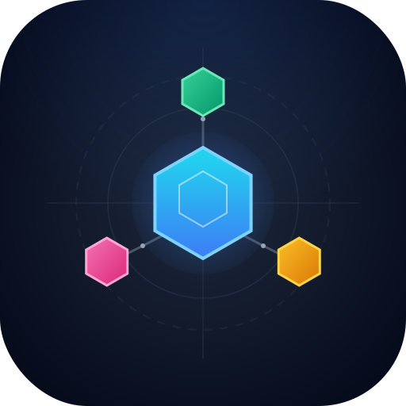

<div align="center">
  
</div>

# Agent Assistant

**Multi-agent orchestration for AI coding assistants**

Transform one AI into a coordinated team of 20 specialist agents with structured workflows and 310+ domain skills.

[](https://opensource.org/licenses/MIT)
[](https://nodejs.org/)
[](http://makeapullrequest.com)

---

## Why Agent Assistant?

| 🎯 Feature | What It Does |
|------------|--------------|
| **One-Time Setup, Forever Use** | Configure once at global level (`~/.cursor/`, `~/.claude/`, etc.) and it auto-applies to ALL your projects. No more repetitive config for every new repo. |
| **Sub-Agent Orchestration** | When supported (Claude Code, Cursor Max mode), the main agent spawns specialized sub-agents to handle tasks **in parallel** — backend, frontend, testing, security all working simultaneously. |
| **Multi-Platform Support** | Works seamlessly across **Cursor**, **GitHub Copilot**, **Claude Code**, and **Antigravity/Gemini**. Same workflows, any tool. |
| **Matrix Skill Discovery** | Automatically injects the right skills into each agent based on their profile and your request. 310+ skills, zero manual config. |

### The Goal

> **Code less, deliver more.** Reduce token costs by 85%, cut bugs by 70%, and stop wasting time on repetitive tasks.

---

## Quick Results

| Metric | Improvement |
|--------|-------------|
| ⏰ Time-to-Production | **70% faster** |
| 🐛 Bug Rate | **70% reduction** |
| 💰 Token Cost | **85% savings** |

---

## Installation

```bash
# Clone
git clone https://github.com/hainamchung/agent-assistant.git
cd agent-assistant

# Install for your tool(s)
node cli/install.js install cursor      # Cursor
node cli/install.js install claude      # Claude Code
node cli/install.js install copilot     # GitHub Copilot
node cli/install.js install antigravity # Antigravity/Gemini
node cli/install.js install --all       # All tools
```

That's it. The framework installs globally and works across all your projects.

---

## Quick Start

### 1. Generate Project Docs (Recommended)

```bash
/docs:core       # Technical docs for AI context
/docs:business   # Business requirements
```

Creates `./documents/` files that agents reference. Without docs, agents work generically. With docs, they follow YOUR patterns.

### 2. Start Building

```bash
/cook:fast "add dark mode toggle"           # Simple feature
/cook:hard "implement OAuth 2.0"            # Complex feature with all quality gates
/fix "payment fails on Safari"              # Bug fix
/plan "build notification system"           # Implementation plan
/test:hard "user registration flow"         # Generate tests
/review "audit auth module"                 # Code review
```

### Variants

| Variant | Use For | Agents |
|---------|---------|--------|
| `:fast` | Simple tasks | 2-3 agents |
| `:hard` | Complex features | 5-8 agents + quality gates |

---

## Commands Reference

| Category | Commands |
|----------|----------|
| **Build** | `/cook`, `/code`, `/fix` |
| **Quality** | `/test`, `/review`, `/debug` |
| **Plan** | `/plan`, `/brainstorm`, `/design` |
| **Docs** | `/docs:core`, `/docs:business`, `/docs:audit` |
| **Deploy** | `/deploy:check`, `/deploy:preview`, `/deploy:production` |

---

## 20 Specialist Agents

| Domain | Agents |
|--------|--------|
| **Implementation** | backend-engineer, frontend-engineer, mobile-engineer, game-engineer |
| **Architecture** | tech-lead, database-architect |
| **Quality** | tester, reviewer, debugger, security-engineer |
| **Planning** | planner, brainstormer, business-analyst |
| **Support** | designer, devops-engineer, docs-manager, performance-engineer, researcher, scouter, project-manager |

---

## Matrix Skill Discovery

Agents don't have hardcoded skills. They declare a **profile**, and the Matrix automatically injects relevant skills:

```yaml
# Agent declares:
profile: "backend:execution"

# Matrix resolves → 20+ backend skills injected automatically
```

**310+ skills** across 19 domains. Add a new skill once, all relevant agents get it instantly.

---

## Project Structure

```
agent-assistant/
├── agents/          # 20 specialist agents
├── commands/        # 40+ workflow commands
├── rules/           # 8 orchestration rules
├── matrix-skills/   # 19 domain skill registries
├── skills/          # 310+ domain skills
└── cli/             # Installer
```

---

## Supported Tools

| Tool | Status | Install Path |
|------|--------|--------------|
| Cursor | ✅ Full | `~/.cursor/` |
| Claude Code | ✅ Full | `~/.claude/` |
| GitHub Copilot | ✅ Full | `~/.copilot/` |
| Antigravity | ✅ Full | `~/.gemini/` |

---

## Contributing

1. Fork → Branch → Commit (`feat:`, `fix:`, `docs:`) → PR
2. Areas: Agents, Commands, Skills, Matrix, Docs, Bug fixes

---

## Support

If this helps you ship faster, consider buying me a coffee!

<a href="https://buymeacoffee.com/hainamchuns" target="_blank">
  
</a>

<br/>

<br/>


---

## License

MIT — [NamCH](https://github.com/hainamchung) — [Issues](https://github.com/hainamchung/agent-assistant/issues)

<div align="center">

**Agent Assistant** — _Code less. Deliver more._

</div>
